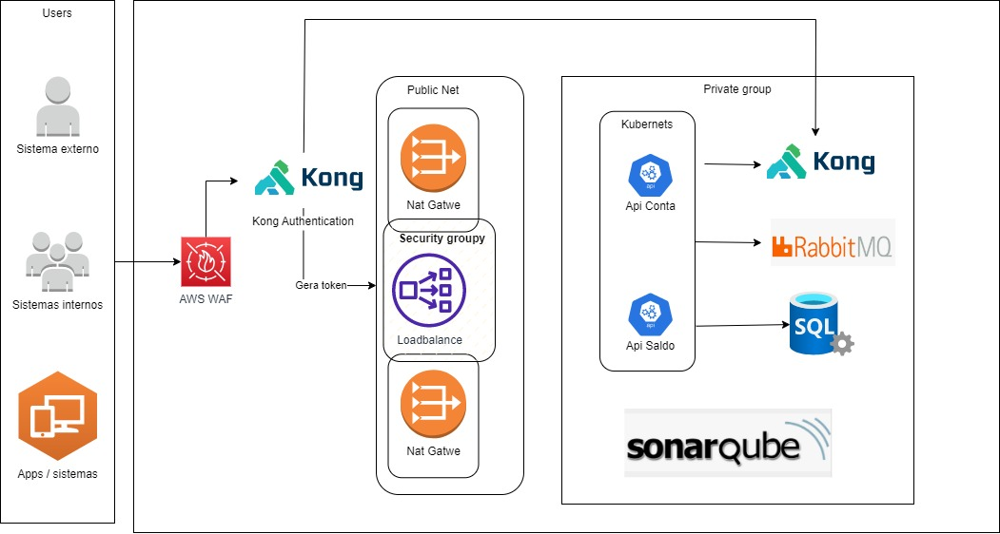

Projeto aplicando DDD, micro serviços, orientação a eventos  e conteinerização .  
Abaixo segue um desenho da arquitetura de deploy, aplicação e um breve descritivo sobre as chamadas  .  
Para rodar o projeto utilizar o docker compose .  
 
 
Arquitetura de aplicação C4Model nivel 1  

 
Deslumbrando uma alta volumetria, foi especificado dois domínios , sendo eles um para toda a transação e outro para geração de relatórios diversos , que podem ser solicitados por qualquer área . 
Pensando em uma arquitetura de micriserviços e DDD, terá um serviço para cadastro de cliente (on-boarding) onde será responsável pela criação do usuário e este projeto apenas irá consumi-lo. 
Pensando em um grande volume transacional, se criou um banco de dados em mongoDB ,que já tem todo o contexto transacional para diferentes colections, diferente do cosmosdb para persistência de saldo. Por vivência passada, já verifiquei na prática que o sql começa a ficar indesejado após 10 mil transações por segundo . 
Também pensando em grande volumetria e ser algo transacional ,  foi criado uma materialização do cadastro de cliente  que será feita no mongodb. 
Após a persistência da informação, será disparado um evento de débito ou crédito, podendo de início ter o  mesmo corpo de mensagem . 
O evento de crédito e débito será materializado no domínio de relatórios e poderá ser feita a extração personalizada conforme demandante . 
 
 
Arquitetura da nuvem   
Para deploy da aplicação se pensou em um kubernets e kong para autenticação.   

